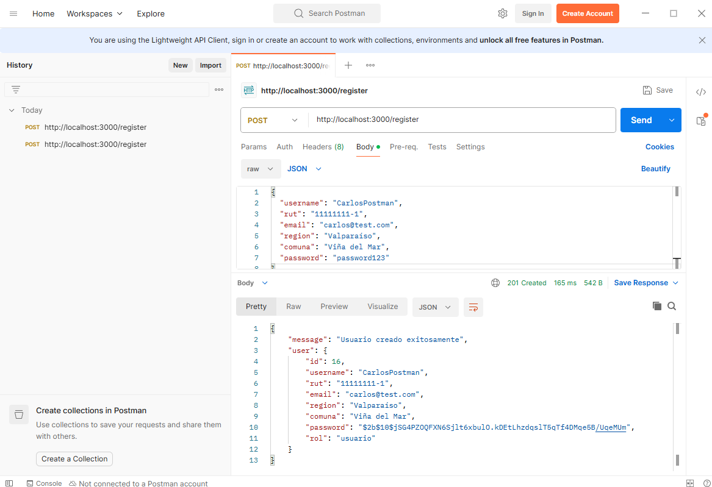
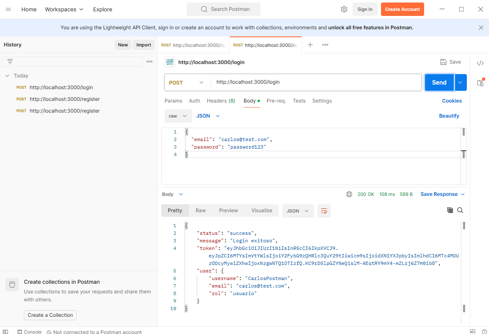
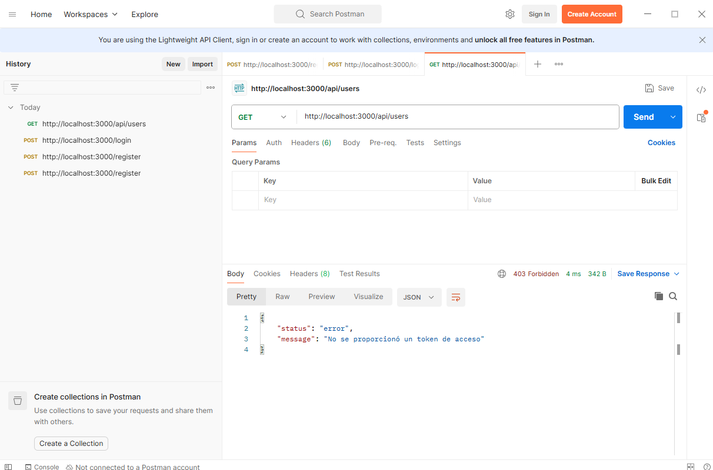
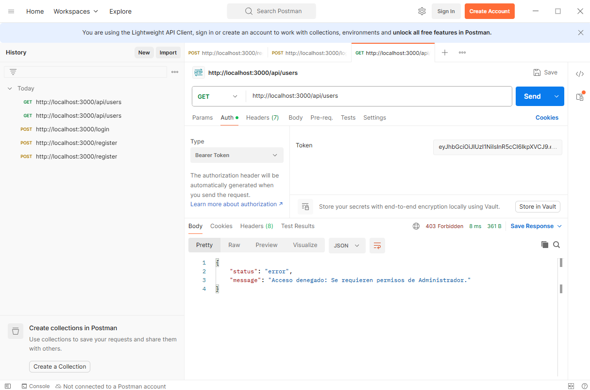

# Huellas Seguras 🐾

**Huellas Seguras** es una plataforma integral diseñada para abordar la problemática de la tenencia irresponsable y la proliferación de animales callejeros en zonas urbanas. 
A través de una arquitectura Full-Stack, la aplicación conecta a la ciudadanía con la gestión municipal para mejorar el bienestar animal y la salud pública.

---

## 1.1.1 Requerimientos Funcionales

El sistema se basa en la interacción de dos roles principales: **Usuario (Ciudadano)** y **Administrador (Gestión Municipal)**. Las funcionalidades clave son:

| ID | Requerimiento | Descripción | Rol |
| :--- | :--- | :--- | :--- |
| **RF01** | **Reportar animales** | Registro de animales abandonados incluyendo fotografía descriptiva y ubicación exacta vía GPS. | Usuario |
| **RF02** | **Sistema de adopción** | Catálogo interactivo para encontrar y postular a la adopción de animales rescatados disponibles. | Usuario |
| **RF03** | **Mapa interactivo** | Visualización dinámica de zonas críticas con mayor presencia de animales para facilitar la gestión territorial. | Usuario / Admin |
| **RF04** | **Solicitar rescate** | Canal directo para pedir asistencia a organizaciones de rescate o departamentos municipales especializados. | Usuario |
| **RF05** | **Seguimiento de casos** | Módulo para revisar en tiempo real el estado y los avances de los reportes realizados por el usuario. | Usuario |
| **RF06** | **Perfil de usuario** | Centro de gestión personal donde el usuario administra sus reportes activos, historial y solicitudes de adopción. | General |
| **RF07** | **Solicitud de Esterilización/Chip** | Reserva de turnos para operativos de esterilización o implantación de microchips. | Usuario |


## 1.1.2 Requerimientos NO Funcionales

Para asegurar un software robusto, profesional y eficiente, el sistema cumple con los siguientes estándares:

| ID | Requerimiento | Descripción | Rol |
| :--- | :--- | :--- | :--- |
| **RNF01** | **Seguridad** | Las contraseñas se almacenan en la base de datos PostgreSQL utilizando el algoritmo de hashing **bcrypt**. | Usuario |
| **RNF02** | **Rendimiento** | Consultas optimizadas en PostgreSQL para manejar múltiples reportes georreferenciados simultáneos sin degradar la experiencia de usuario. | Admin |
| **RNF03** | **Usabilidad** | Uso de iconografía clara y flujos de navegación de máximo 3 clics para realizar acciones críticas (como reportar un animal). | Usuario |


### MOCKUPS LINK: https://www.figma.com/design/GaEgGUzTRm7K1F9DxsfeYn/Mockup-Plugin-%E2%80%93-Devices-Mockups--Print-Mockups--Branding-Mockups--Comunidad-?node-id=0-1&t=UNSscuerdPEnrDhV-1


## 1.2 Justificación del Problema y Análisis del Usuario Objetivo

#### Justificación del Problema
La presencia masiva de animales (perros y gatos) en la vía pública no es solo un problema de bienestar animal, sino una crisis de salud pública y ambiental. La falta de control genera:
* **Riesgos Sanitarios:** Proliferación de zoonosis (enfermedades transmitidas de animales a humanos) y parásitos.
* **Seguridad Ciudadana:** Incidentes de mordeduras y accidentes de tránsito.
* **Gestión Insuficiente:** Los municipios suelen carecer de datos en tiempo real para actuar de forma preventiva, limitándose a respuestas reactivas.

**Huellas Seguras** soluciona esto digitalizando el reporte ciudadano y optimizando la respuesta administrativa mediante datos georreferenciados.


#### Análisis del Usuario Objetivo
El proyecto define dos perfiles de usuario con necesidades distintas:

1.  **Usuario General (Ciudadano):**
    * **Perfil:** Personas residentes de la comuna preocupadas por el bienestar animal o dueños de mascotas que buscan servicios municipales.
    * **Necesidad:** Una herramienta fácil de usar desde el móvil para reportar situaciones de riesgo o acceder a beneficios (chips/esterilización) de forma rápida.

2.  **Administrador (Gestión Municipal/Salud):**
    * **Perfil:** Funcionarios del departamento de higiene ambiental o veterinaria municipal.
    * **Necesidad:** Un panel de control centralizado para visualizar la densidad de animales callejeros, gestionar recursos para operativos y validar que las adopciones cumplan con la normativa legal.

---

## 1.4 Arquitectura de Navegación y Experiencia del Usuario

### 1.4.1 Estructura de Rutas y Roles (a, d)
La aplicación utiliza un sistema de rutas protegidas basado en el rol del usuario autenticado:

| Path | Funcionalidad | Acceso |
| :--- | :--- | :--- |
| `/login` | Acceso al sistema | Público |
| `/home` | Dashboard de módulos | Privado (Todos) |
| `/report` | Formulario de reporte GPS/Foto | Privado (Usuario) |
| `/admin/manage` | Validación de casos de rescate | Privado (**Admin**) |
| `/admin/heatmap` | Análisis de zonas críticas | Privado (**Admin**) |

### 1.4.2 Jerarquía de Vistas y Flujo (b, c)
Se implementó un patrón **Hub & Spoke**:
1.  **Nivel Central (Home):** Un panel de control con 6 tarjetas visuales que representan los módulos principales.
2.  **Nivel de Acción:** Pantallas específicas para cada tarea. Al finalizar cualquier flujo (ej. enviar reporte), el sistema retorna automáticamente al "Hub" principal para mantener la orientación del usuario.

### 1.4.3 Flujo de Tarea Principal: Reporte de Animal (e)
1.  **Selección:** El usuario pulsa "Reportar animales" en el Home.
2.  **Captura:** Se activa la cámara y el sensor GPS del dispositivo.
3.  **Registro:** El usuario completa datos mínimos (estado del animal, tipo).
4.  **Sincronización:** El backend (Node.js) procesa la solicitud y la guarda en PostgreSQL.
5.  **Confirmación:** Alerta visual de éxito y redirección a "Seguimiento de casos".

### 1.4.4 Puntos Críticos y Coherencia (f, g)
* **Interacción Crítica:** Gestión de permisos de Cámara/GPS. Se implementaron diálogos informativos para asegurar que el usuario entienda por qué son necesarios.
* **Coherencia Multidispositivo:** Gracias a Ionic, los componentes se adaptan automáticamente: en **iOS** muestran transiciones laterales suaves, en **Android** transiciones hacia arriba, y en **Desktop** el grid de módulos se expande de 2 a 4 columnas para optimizar el espacio.

### 1.4.5 Justificación Técnica (h)
La arquitectura se basa en **Cards Visuales** para maximizar la usabilidad en exteriores (botones grandes para uso con una sola mano). Se utiliza `React Router` para una navegación instantánea (SPA), lo que garantiza **escalabilidad** (añadir nuevos módulos sin romper la estructura actual) y **claridad estructural** para el usuario final.

---

## 2. Implementación de Ingeniería de Software (Backend & Base de Datos)

### 2.1 Configuración y Modelado de la Base de Datos Relacional (EP 2.2)
Se implementó un diseño de base de datos relacional robusto sobre **PostgreSQL**, aplicando restricciones de clave primaria, restricciones de unicidad (`UNIQUE`) y control estricto de nulos para garantizar la integridad de los datos:

```sql
CREATE TABLE usuarios (
    id SERIAL PRIMARY KEY,
    username VARCHAR(100) NOT NULL,
    rut VARCHAR(12) NOT NULL UNIQUE,
    email VARCHAR(150) NOT NULL UNIQUE,
    region VARCHAR(100) NOT NULL,
    comuna VARCHAR(100) NOT NULL,
    password VARCHAR(255) NOT NULL,
    rol VARCHAR(20) DEFAULT 'usuario',
    created_at TIMESTAMP DEFAULT CURRENT_TIMESTAMP
);
```

### 2.2 Desarrollo de la API REST y Seguridad 
El backend construido sobre **Node.js + Express** expone un contrato CRUD estándar que responde en formato JSON estructurado uniforme. 
* **Protección contra Inyección SQL:** Todas las interacciones a la base de datos se ejecutan usando **Consultas Preparadas** (parametrizadas mediante marcadores `$1, $2, ...`), neutralizando cualquier vector de ataque por inyección de código SQL malicioso.
* **Seguridad de Credenciales:** El flujo de `/register` aplica técnicas de Hashing asíncrono con **bcrypt**, garantizando que las claves queden cifradas de manera irreversible en el almacenamiento.

### 2.4 Control de Autenticación por Tokens JWT 
El endpoint `/login` verifica la firma de la contraseña encriptada y procede a codificar digitalmente un token firmado bajo un secreto del servidor (`jsonwebtoken`), empaquetando el identificador del usuario, su correo y su respectivo nivel de rol (`usuario` o `admin`).

Se incorporó un Middleware centralizado (`verificarToken`) en Express que intercepta los encabezados de las peticiones HTTP (`Authorization: Bearer <TOKEN>`), garantizando el control de accesos a nivel de servidor antes de ejecutar transacciones críticas.

### 2.7 Pruebas Funcionales en Postman y Evidencias

Para certificar el correcto funcionamiento e integración de los componentes, se estructuró un set de pruebas dentro de la plataforma **Postman**. A continuación se detalla el flujo de ejecución paso a paso junto a sus respectivas capturas de pantalla:

### Paso A: Prueba de Registro Exitoso con Validaciones (POST)
Se envía una petición de tipo **POST** a `http://localhost:3000/register` con un payload JSON estructurado en el cuerpo (`Body -> raw -> JSON`). El servidor procesa el hash bcrypt e inserta con éxito las restricciones devolviendo un código **201 Created**.
* Si se intenta reenviar el mismo payload, el servidor responde controlando la excepción devolviendo que el RUT o el Email ya se encuentran ocupados.



### Paso B: Prueba de Inicio de Sesión y Generación de JWT (POST)
Se realiza una petición **POST** a `http://localhost:3000/login`...



### Paso C: Prueba de Seguridad - Bloqueo de Ruta Protegida (GET Anónimo)
Se simula el ingreso a una ruta protegida...



### Paso D: Acceso Validado mediante Interceptores / Tokens Bearer (GET Autenticado)
Se inyecta el token largo obtenido...



## 3. Stack Tecnológico

* **Frontend:** Ionic Framework con React.
* **Backend:** Node.js con Express.
* **Base de Datos:** PostgreSQL.
* **Control de Versiones:** Git & GitHub.

---

## 4. Instalación y Configuración

### Requisitos previos
* Node.js (v18 o superior)
* PostgreSQL instalado localmente o en la nube.

### Configuración del Backend
1. Entrar a la carpeta `server`.
2. Ejecutar `npm install`.
3. Configurar las variables de entorno en un archivo `.env`.
4. Iniciar con `node index.js`.

### Configuración del Frontend
1. Entrar a la carpeta raíz.
2. Ejecutar `npm install`.
3. Iniciar la aplicación con `ionic serve`.


